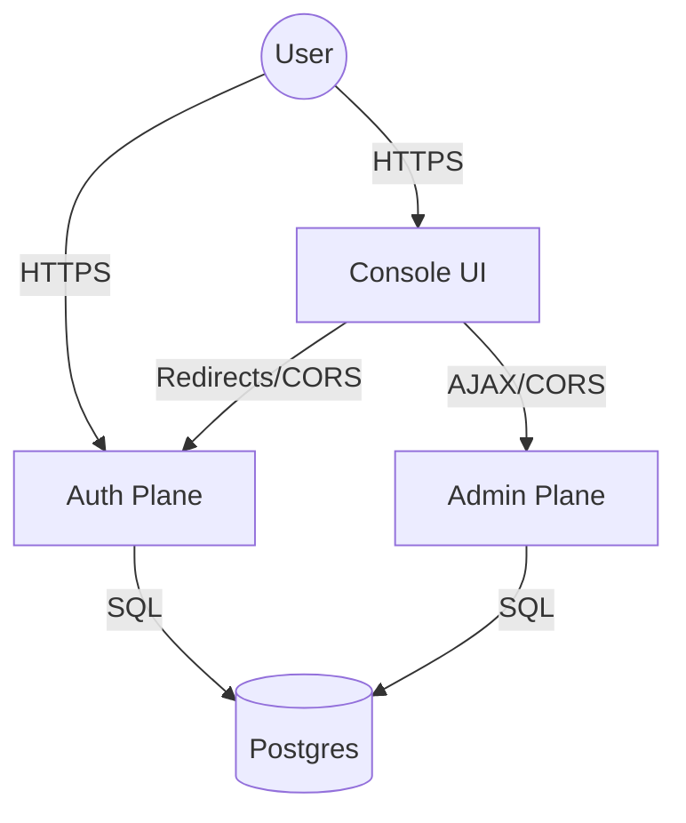

# Runtime Topology

## Overview
OpenTrusty operates as a distributed system comprised of distinct "planes". While they may share a binary (`opentrusty`), they MUST run as separate processes in production to ensure security isolation and independent scaling.

## Service Planes

### 1. Auth Plane (`serve auth`)
-   **Role**: Identity Provider (IdP).
-   **Responsibilities**:
    -   User Login/Logout.
    -   OIDC Protocol (Authorize, Token, UserInfo).
    -   OAuth2 Protocol (Client Credentials).
-   **Public Access**: Yes (Internet Facing).
-   **Domain**: `auth.opentrusty.org` (Canonical).

### 2. Admin Plane (`serve admin`)
-   **Role**: Management API (Control Plane).
-   **Responsibilities**:
    -   Tenant Management (Create, List, Configure).
    -   User Management (Assign Roles, Provision).
    -   System Health & Metrics.
-   **Public Access**: Restricted (Admin Only, internal or VPN recommended).
-   **Domain**: `api.opentrusty.org` (Canonical).

### 3. Console Plane (Static Frontend)
-   **Role**: Administrative UI.
-   **Responsibilities**:
    -   Human-facing dashboard for Platform/Tenant admins.
    -   Pure OIDC Client (consumes Auth Plane).
    -   Pure API Client (consumes Admin Plane).
-   **Public Access**: Yes.
-   **Domain**: `console.opentrusty.org` (Canonical).

## Communication Flows

## Security Isolation
-   **Cookies**: The Session Cookie is `HttpOnly` and scoped to the parent domain (e.g., `.opentrusty.org`) to allow sharing between Auth and Admin planes.
-   **CORS**:
    -   Auth Plane: Allows Console Origin.
    -   Admin Plane: Allows Console Origin.
-   **Network**: Admin Plane should not expose OIDC endpoints; Auth Plane should not expose Management APIs.
