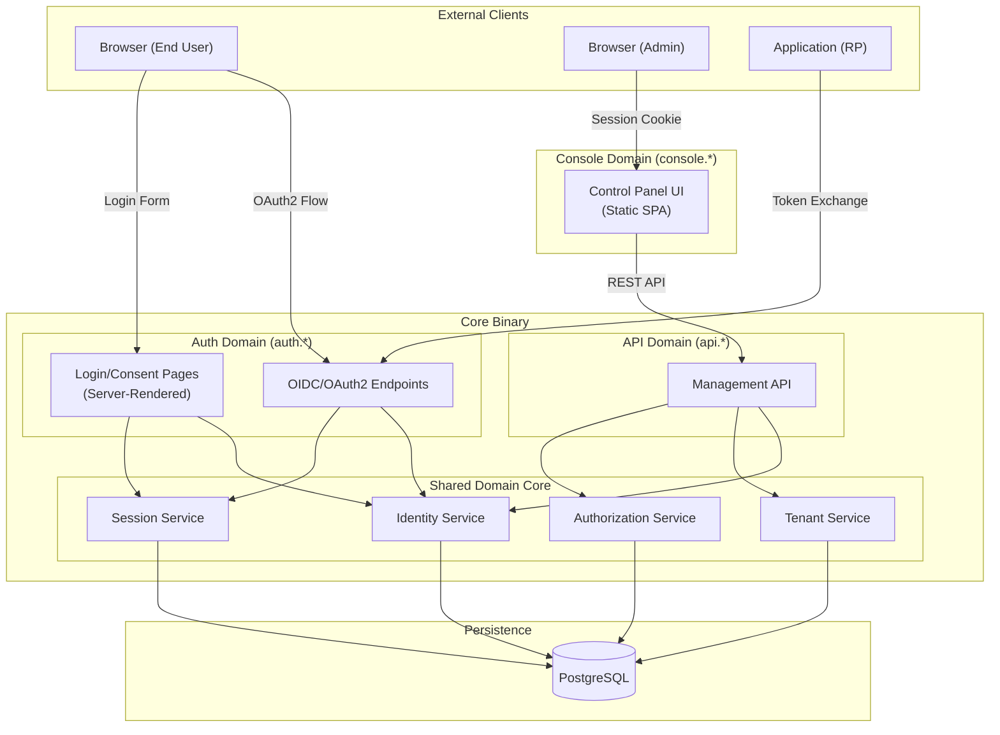
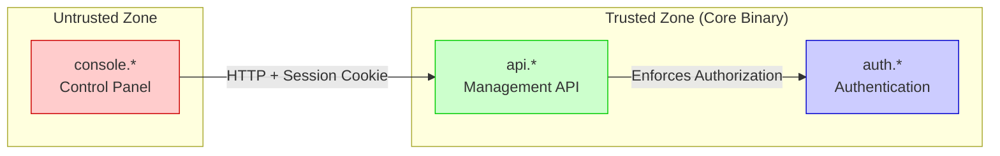
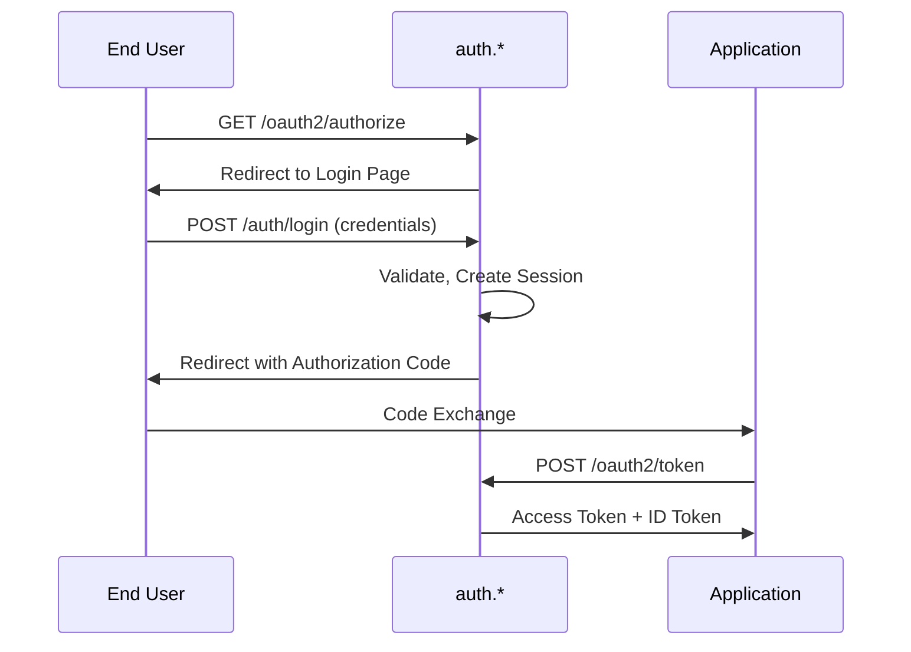
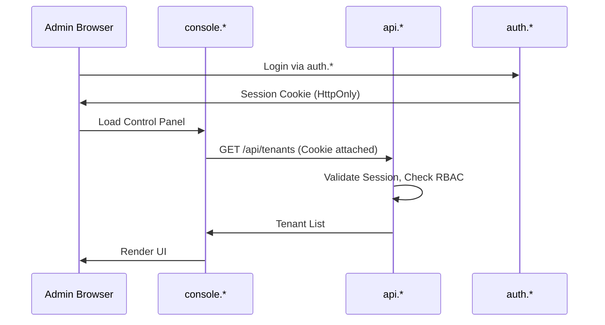

# System Topology

This document defines the deployment topology and trust domains for OpenTrusty.

## Trust Domains

OpenTrusty operates across three distinct trust domains, each with different security characteristics.

## Domain Responsibilities

| Domain | Subdomain | Trust Level | Responsibilities |
|--------|-----------|-------------|------------------|
| **Auth** | `auth.*` | Highest | OIDC/OAuth2 protocol, credential verification, session cookies, server-rendered login pages |
| **API** | `api.*` | High | Tenant/user/client management, RBAC enforcement, admin operations |
| **Console** | `console.*` | Untrusted | Human-facing admin UI, API consumer, zero business logic |

## Security Isolation

### Key Invariants

1. **Console is Untrusted**: The Control Panel UI cannot bypass API authorization
2. **Shared Session Cookies**: Browser sessions are HttpOnly cookies issued by Auth domain
3. **No Direct DB Access**: Console never touches the database directly
4. **Separate Deployment**: Console is a separate artifact, not embedded in core binary

## Browser Interaction Flows

### End-User Authentication Flow

### Admin Console Flow

## Deployment Topology

| Component | Artifact | Repository |
|-----------|----------|------------|
| Auth + API | Single Go binary | `opentrusty` |
| Console | Static SPA | `opentrusty-control-panel` |
| Database | PostgreSQL | External dependency |

**The core binary exposes two entrypoints:**
- `auth.*` — Authentication Plane (OIDC/OAuth2)
- `api.*` — Management API Plane (Admin REST)

**The Control Panel is deployed separately:**
- Static files served via CDN, Nginx, or similar
- Never bundled into the core binary
