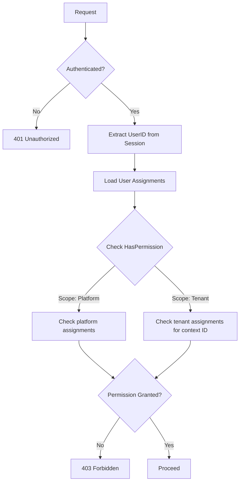

# OpenTrusty Authorization Model

**Version:** 1.0
**Last Updated:** 2025-12-23

---

## 1. Design Decisions

### 1.1 Roles vs Permissions
- **Roles are first-class entities** stored in the database (`rbac_roles` table).
- **Permissions are constants** defined in code (`internal/authz/permissions.go`).
- Roles aggregate permissions; authorization checks use `HasPermission(permission)`.
- This allows flexible role definitions while maintaining compile-time safety for permission names.

### 1.2 Scopes
- **Scopes are internal/technical**, not user-facing.
- Three scopes exist: `platform`, `tenant`, `client`.
- Scopes determine the context in which a role assignment is valid.
- End users see "roles" (e.g., "Tenant Admin"), not scopes.

### 1.3 Tenant Isolation Principle
- **No tenant represents the platform.** There is no "default" or "system" tenant.
- **Platform privileges come from role assignments**, not tenant membership.
- A Platform Admin is a user with the `platform_admin` role at `ScopePlatform`, NOT a user in a special tenant.

### 1.4 Permission-Only Authorization (Hard Rule)

> [!CAUTION]
> **Authorization decisions MUST be based on permissions only.**
> Roles are configuration constructs and MUST NOT be used in runtime authorization checks.

**Enforcement:**
- The authorization engine (`authz.Service`) exposes **only `HasPermission()`** for runtime checks.
- No handler or service may check role names directly (e.g., `if role == "admin"`).
- `GetUserRoles()` is an internal method used only to derive permissions, never for authorization decisions.
- Role validation (e.g., checking if a role name is valid) is permitted only in admin/configuration APIs for input validation.

**Rationale:**
- Roles can be reconfigured without code changes.
- Permission checks are explicit and auditable.
- Avoids privilege escalation via role name confusion or typos.

## 2. Actor Model

| Actor | Scope | Description |
|-------|-------|-------------|
| `platform_admin` | Platform | Full platform control: manage tenants, bootstrap, view all resources. |
| `tenant_owner` | Tenant | Full control within a single tenant. Can manage users, clients, and settings. |
| `tenant_admin` | Tenant | Administrative access within a tenant. Can manage users and some settings. |
| `tenant_member` | Tenant | Basic membership. Can access own profile and resources granted by the tenant. |
| `external_client` | Client | OAuth2 client acting on behalf of a user. Limited by granted scopes. |

---

## 3. Permission Catalog

### 3.1 Platform Permissions
| Constant | String Value | Description |
|----------|--------------|-------------|
| `PermPlatformManageTenants` | `platform:manage_tenants` | Create, update, delete tenants. |
| `PermPlatformManageAdmins` | `platform:manage_admins` | Assign/revoke platform admin role. |
| `PermPlatformViewAudit` | `platform:view_audit` | View platform-wide audit logs. |
| `PermPlatformBootstrap` | `platform:bootstrap` | Execute bootstrap operations. |

### 3.2 Tenant Permissions
| Constant | String Value | Description |
|----------|--------------|-------------|
| `PermTenantManageUsers` | `tenant:manage_users` | Add/remove users, assign tenant roles. |
| `PermTenantManageClients` | `tenant:manage_clients` | Register/update/delete OAuth2 clients. |
| `PermTenantManageSettings` | `tenant:manage_settings` | Update tenant configuration. |
| `PermTenantViewUsers` | `tenant:view_users` | List users and their roles. |
| `PermTenantView` | `tenant:view` | View tenant metadata. |
| `PermTenantViewAudit` | `tenant:view_audit` | View tenant-scoped audit logs. |

### 3.3 User Permissions (Self-Service)
| Constant | String Value | Description |
|----------|--------------|-------------|
| `PermUserReadProfile` | `user:read_profile` | Read own profile. |
| `PermUserWriteProfile` | `user:write_profile` | Update own profile. |
| `PermUserChangePassword` | `user:change_password` | Change own password. |
| `PermUserManageSessions` | `user:manage_sessions` | View/revoke own sessions. |

### 3.4 Client Permissions (OAuth2)
| Constant | String Value | Description |
|----------|--------------|-------------|
| `PermClientTokenIntrospect` | `client:token_introspect` | Introspect access tokens. |
| `PermClientTokenRevoke` | `client:token_revoke` | Revoke tokens. |

---

## 4. Role Definitions

### 4.1 Platform Roles

#### `platform_admin`
- **Scope:** Platform
- **Permissions:** `*` (wildcard)
- **Description:** Full platform control.

### 4.2 Tenant Roles

#### `tenant_owner`
- **Scope:** Tenant
- **Permissions:**
  - `tenant:manage_users`
  - `tenant:manage_clients`
  - `tenant:manage_settings`
  - `tenant:view_users`
  - `tenant:view`
  - `tenant:view_audit`
  - `user:read_profile`
  - `user:write_profile`
  - `user:change_password`
  - `user:manage_sessions`

#### `tenant_admin`
- **Scope:** Tenant
- **Permissions:**
  - `tenant:manage_users`
  - `tenant:manage_clients`
  - `tenant:view_users`
  - `tenant:view`
  - `user:read_profile`
  - `user:write_profile`
  - `user:change_password`
  - `user:manage_sessions`

#### `tenant_member`
- **Scope:** Tenant
- **Permissions:**
  - `tenant:view`
  - `user:read_profile`
  - `user:write_profile`
  - `user:change_password`

---

## 5. Authorization Flow

---

## 6. Scope Resolution Rules

1. **Platform scope** assignments grant permissions globally.
2. **Tenant scope** assignments grant permissions only within the specified `scope_context_id` (tenant ID).
3. **Client scope** assignments grant permissions only for the specified OAuth2 client.
4. A user may have multiple assignments across different scopes.
5. Authorization checks should specify the required scope and context.

---

## 7. External Client (OAuth2) Authorization

OAuth2 clients act on behalf of users. Their permissions are the **intersection** of:
1. The user's permissions.
2. The scopes granted during authorization (e.g., `openid`, `profile`).
3. The client's registered `allowed_scopes`.

Clients cannot exceed the user's permissions, even if the client requests broader scopes.
