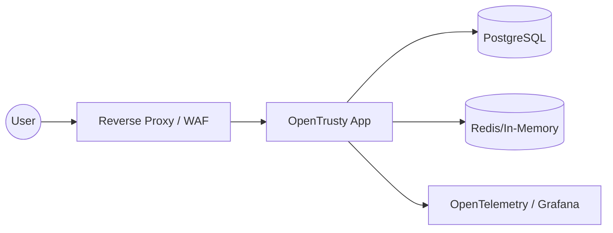

# OpenTrusty Production Deployment Guide

This guide provides technical recommendations for deploying OpenTrusty in a production environment.

## 1. Reference Architecture

## 2. Infrastructure Hardening

### 2.1 TLS Termination
- **Mandatory**: Do not expose OpenTrusty directly over HTTP.
- **Headers**: Your proxy must set `X-Forwarded-For` and `X-Real-IP`.
- **HSTS**: Enable HTTP Strict Transport Security with a long `max-age`.

### 2.2 Database
- **SSL/TLS**: Always use `sslmode=verify-full` or `verify-ca` for database connections.
- **Backups**: Implement automated point-in-time recovery (PITR).
- **Isolation**: Use a dedicated user for the application with minimal `SELECT/INSERT/UPDATE` permissions.

## 3. Configuration Best Practices

### 3.1 Session Security
Configure your environment variables for maximum session safety:
- `SESSION_COOKIE_SECURE=true` (Requires HTTPS)
- `SESSION_COOKIE_HTTP_ONLY=true` (Prevents XSS theft)
- `SESSION_COOKIE_SAME_SITE=Lax` (Prevents CSRF while allowing OIDC redirects)

### 3.2 Secrets Management
- **Keys**: Never commit RSA signing keys or client secrets to Git. Use a Secret Manager (AWS Secrets Manager, Vault).
- **Encryption**: Authorization codes and tokens are encrypted at rest; ensure the AES master key is rotated periodically.

## 4. Observability

### 4.1 Audit Logs
Keep audit logs for at least 90 days. They are essential for compliance and forensic analysis.
- **Otel**: Export logs to a centralized collector via OpenTelemetry for non-repudiation.

### 4.2 Health Checks
The `/health` endpoint should be monitored by your orchestrator (Kubernetes/Docker) for liveness and readiness.
