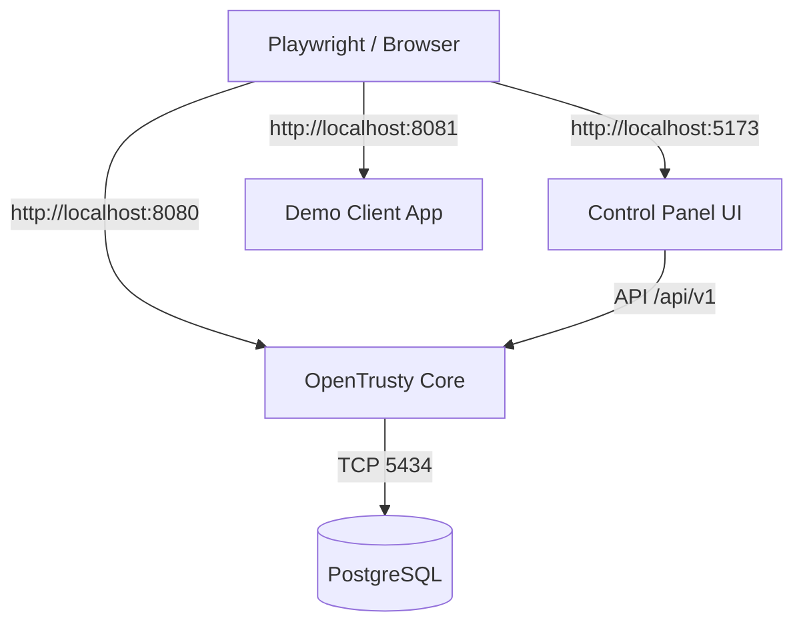

# Local E2E Test Topology

This document defines the standardized port and service configuration for local End-to-End (E2E) testing. All automated UI tests assume this topology.

## Network Architecture



## Service Definitions

| Service | Component | Local URL | Command | Notes |
| :--- | :--- | :--- | :--- | :--- |
| **Auth & Admin API** | `opentrusty` | `http://localhost:8080` | `opentrusty serve all` | Runs both Auth and Admin planes on a single port for local dev simplicity. |
| **Control Panel** | `opentrusty-control-panel` | `http://localhost:5173` | `npm run dev` | VITE dev server interacting with Core. Proxies API requests to 8080. |
| **Demo Client** | `opentrusty-demo-app` | `http://localhost:8081` | `./demo-app` | Standalone OAuth2 Relying Party for OIDC flow verification. |
| **Database** | `postgres` | `localhost:5434` | `docker compose up` | Isolated test database to prevent data pollution. |

## Environment Variables

### OpenTrusty Core
```bash
SERVER_PORT=8080
DB_PORT=5434
OT_BOOTSTRAP_ADMIN_EMAIL=admin@platform.local
```

### Control Panel
```bash
VITE_API_BASE_URL=http://localhost:8080
```

### Demo App
```bash
PORT=8081
AUTH_URL=http://localhost:8080
CLIENT_ID=<dynamic>
CLIENT_SECRET=<dynamic>
REDIRECT_URI=http://localhost:8081/callback
```
