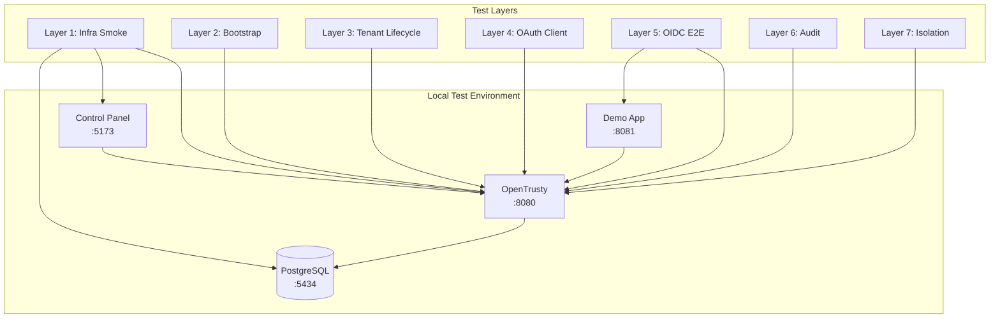

# Local System Test Guide

Complete guide for running the OpenTrusty Local System Validation Suite.

## Overview

This test suite validates OpenTrusty as a Beta-grade Identity Provider through 7 automated test layers, from infrastructure sanity checks to end-to-end OIDC flows.

## System Topology



## Prerequisites

| Requirement | Version |
|-------------|---------|
| Docker | 20.10+ with Compose V2 |
| Go | 1.21+ |
| Node.js | 18+ |
| curl | Any |
| jq | Any |

## Quick Start

```bash
# From opentrusty repo root
./tests/local/run-all.sh
```

Expected duration: **5-10 minutes**

## Test Layers

### Layer 1: Infrastructure Sanity

Validates all services are reachable:
- PostgreSQL on port 5434
- OpenTrusty `/health` endpoint
- OIDC Discovery endpoint
- Control Panel (optional)

### Layer 2: Bootstrap & Platform Admin

Validates platform bootstrapping:
- Platform admin auto-provisioned
- Admin can login
- Session cookie created
- `/auth/me` returns user

### Layer 3: Tenant Lifecycle

Validates multi-tenancy:
- Tenant created via API
- Tenant admin registered
- Tenant admin login
- Session scoped to tenant

### Layer 4: OAuth2 Client Management

Validates client registration:
- Client created with redirect_uri
- Client secret generated (shown once)
- Client appears in listing
- Secret not leaked in GET

### Layer 5: End-to-End OIDC Flow

Validates complete authorization code flow:
1. User login
2. Authorization request with PKCE
3. Code exchange for tokens
4. ID Token claim validation (iss, aud, sub)

### Layer 6: Audit & Observability

Validates audit logging:
- Login events logged
- Registration events logged
- Structured logging (slog)
- No PII in logs

### Layer 7: Negative & Isolation Tests

Validates security boundaries:
- Invalid redirect_uri rejected
- Cross-tenant access denied
- Reused auth code rejected
- Invalid client_secret rejected
- Unauthenticated access denied
- Tenant spoofing blocked

## Failure Interpretation

| Error | Likely Cause | Resolution |
|-------|--------------|------------|
| PostgreSQL DOWN | Docker not running | `docker compose up -d` |
| Health check timeout | Build failed | Check `reports/opentrusty.log` |
| Login FAIL | Bootstrap not run | Verify migrations applied |
| No auth code | Session missing | Check cookie handling |
| Token exchange FAIL | PKCE mismatch | Verify code_verifier |

## Manual Verification

For human reviewers:

```bash
# Start environment without tests
./tests/local/run-all.sh --no-tests

# Open in browser
open http://localhost:5173/admin/   # Control Panel
open http://localhost:8081/         # Demo App

# Check health
curl http://localhost:8080/health

# Check OIDC discovery
curl http://localhost:8080/.well-known/openid-configuration | jq
```

## Reports

Generated in `tests/local/reports/`:

| Report | Description |
|--------|-------------|
| `infra-smoke.md` | Service health status |
| `bootstrap-test.md` | Platform admin setup |
| `tenant-lifecycle.md` | Tenant creation flow |
| `oauth-client-test.md` | Client registration |
| `oidc-e2e.md` | Authorization code flow |
| `audit-verification.md` | Logging verification |
| `isolation-negative.md` | Security boundary tests |

## Cleanup

Automatic cleanup on exit. Manual:

```bash
cd tests/local
docker compose -f docker-compose.local-test.yml down -v
```

---

*Status: Beta Validation Suite*
